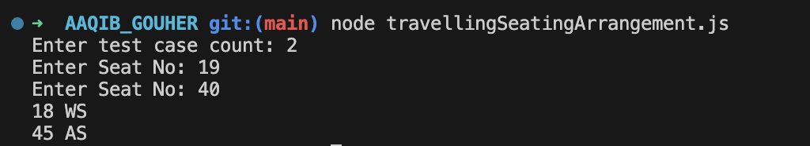
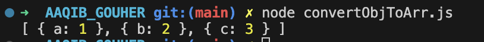
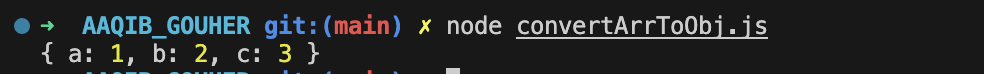

# cureSkinTask 
## Installation
* Clone the repository
* Run `npm install` command, to install the dependencies
* Run the file using `node filename`, Eg: `node travellingSeatingArrangement.js`

** Note: It will show an output in the terminal **

** If you want to run the code in the online platforms, make sure the prompt works, else comment on the required prompt line **

## Output
### 1. Travelling Seating Arrangement

### 2. Convert Object To Array

### 3. Convert Array To Object
